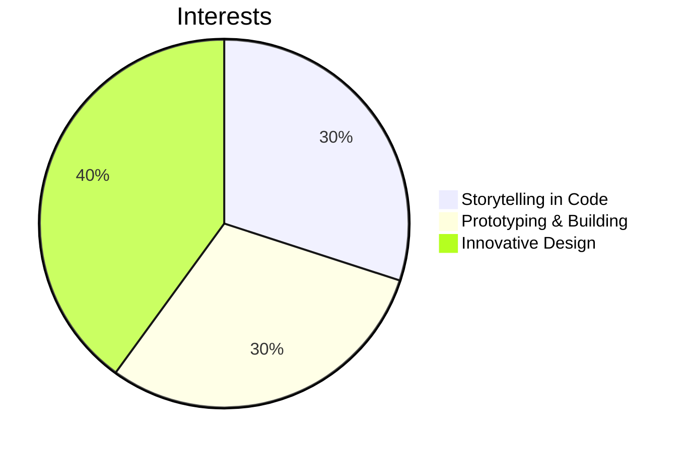

# Hi! I'm Melanie
## Aspiring software developer passionate about building solutions that merge creativity with functionality with expertise in: 
## 1. Full-stack development
- **[Minimalistic Website](https://github.com/melanielaporte/sparse_Website)** 
- **[Memory Card Game](https://github.com/melanielaporte/Pirates-Booty)**
 --> [Play here!](https://editting-lively-shell-121.vscodeedu.app/)
## 2. UI/UX design
- **[Nonprofit Website Design-Farm To Family](https://github.com/melanielaporte/farmtofamilySite)**
- **[Authur Website Design](https://github.com/melanielaporte/writerPortfolioSite)**
## 3. Electronics prototyping.
- **[MoonRatII Printed Circuit Board](https://github.com/PubInv/moonrat)** - Software (C++, Kicad schematic design, Freecad 3D modeling, Ngspice simulation). Hardware (Soldering Station, Multimeter, Arduino, 3D Printer) 

---
## Resources created
- [JLCPCB printed circut board ordering guide](https://github.com/melanielaporte/JLCPCB-Ordering-Guide) the PCB ordering process is complicated, reach out with any questions (photos Coming soon)
- [Frontend project template-HTML, CSS, JavaScript](https://github.com/melanielaporte/project-template-novices) to help you start a project quickly
- [Git Cheatsheet](https://github.com/melanielaporte/gitCheatsheet)

---
## Fun Facts  
- Actively contribute to [Public Invention](https://publicinvention.github.io/) global-impact projects:
[MoonRatII](https://github.com/melanielaporte/moonrat): A portable incubator for rapid fieldwork.
[GDT](https://github.com/gosqasorg/asset-provenance-tracking): A humanitarian asset provenance tracker.
- Interested about bridging creativity and technology — from writing fiction to crafting innovative code.
- Exploring ways to gamify productivity and enhance user experiences with interactive design.
- Enthusiastic about all things DIY and invention, especially prototyping devices that solve real-world problems.
- Looking to collaborate on projects that merge engineering, design, and social impact.

