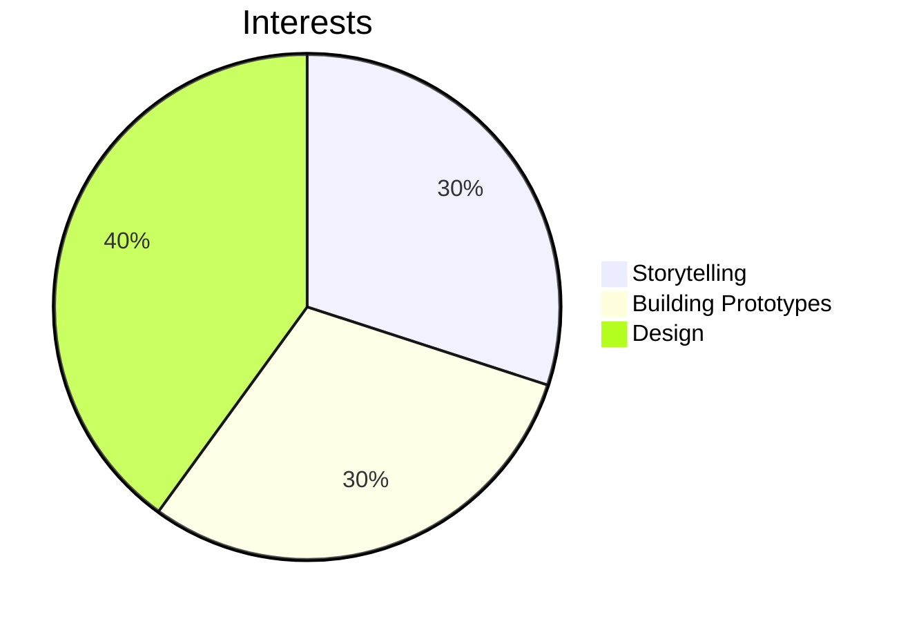

# Welcome to my GitHub! I’m a budding creative engineer and artist. 
Passionate about sustainability, community-driven projects, interactive coding, and a dose of random. Currently exploring ways to use technology for **positive change** and **empowerment**.

---
## Current  
- Actively contribute to [Public Invention](https://publicinvention.github.io/) global-impact projects: [MoonRatII](https://github.com/melanielaporte/moonrat) portable incubator &
   [GDT](https://github.com/gosqasorg/asset-provenance-tracking), an humantarian asset provenence tracker
- **Work in:** Python, HTML, CSS, JavaScript, TypeScript, Kicad PCB design, Arduino, Freecad
- **Learning:** React, MERN stack
- **Next up:** Swift, C++, Blender, Cinema 3D -> Houdini
  
---

## Work
- **Mini Movie: 3001** [Watch here](https://github.com/melanielaporte/Mini-Movie-3001) - PowerPoint
- **[Memory Card Game](https://github.com/melanielaporte/Pirates-Booty)** - HTML, CSS, JS
 --> [Play here!](https://editting-lively-shell-121.vscodeedu.app/)
- **[Minimalistic Website](https://github.com/melanielaporte/sparse_Website)** - Figma, HTML, CSS, JS
- **[MoonRatII Printed Circuit Board](https://github.com/PubInv/moonrat)** - Software (C++, Kicad schematic design, Freecad 3D modeling, Ngspice simulation). Hardware (Soldering Station, Multimeter, Arduino, 3D Printer) 
- **[Nonprofit Website Design-Farm To Family](https://github.com/melanielaporte/farmtofamilySite)** - Figma
- **[Authur Website Design](https://github.com/melanielaporte/writerPortfolioSite)** - Figma
- **3D modeled and printed whistle** Coming Soon - Freecad
- **GoalVault** Coming Soon - Figma, HTML, CSS, JS, React
- **Nonprofit Coded Website** Coming Soon - HTML, CSS, JS
---

## Resources I created, Enjoy!
- [JLCPCB printed circut board ordering guide](https://github.com/melanielaporte/JLCPCB-Ordering-Guide) the PCB ordering process is complicated, reach out with any questions (photos Coming soon)
- [Frontend project template-HTML, CSS, JavaScript](https://github.com/melanielaporte/project-template-novices) to help you start a project quickly
- [Git Cheatsheet](https://github.com/melanielaporte/gitCheatsheet)

---
### Fun Facts  
- Love storytelling — whether it's crafting narratives in code or writing fiction  
- Fascinated by concepts of "choose your own adventure" and gamefying life functions 
- Enjoy all things DIY and invention

