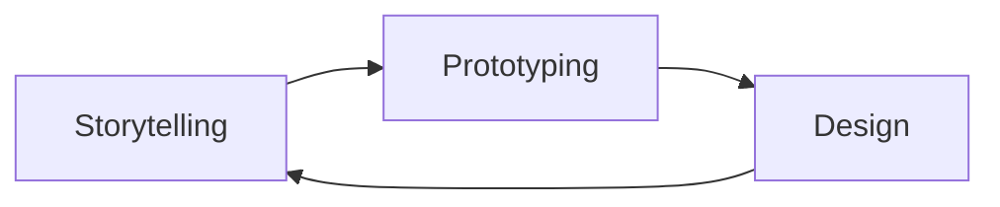

  

  
  

  

 <h1> Hello 
</h1>

### :woman_technologist: About Me :
I am an spiring software developer passionate about building solutions that merge creativity with functionality with expertise   from New York.
- :telescope: I am studying Computer Science at Columbia University and contributing to frontend and backend for building web and app applications.

- :seedling: Exploring 3D modeling.

- :zap: In my free time, I solve cr on GeeksforGeeks and read tech articles.

- :mailbox:How to reach me: 

### :hammer_and_wrench: Languages and Tools :

  &nbsp;
  &nbsp;
  &nbsp;
  
  
  
  
  
  

### :fire: My Stats :
  

-----------------------------

### :bulb: Projects
##### Full-stack development
- **[Minimalistic Website](https://github.com/melanielaporte/sparse_Website)** 
- **[Memory Card Game](https://github.com/melanielaporte/Pirates-Booty)**
 --> [Play here!](https://editting-lively-shell-121.vscodeedu.app/)
  
##### UI/UX design
- **[Nonprofit Website Design-Farm To Family](https://github.com/melanielaporte/farmtofamilySite)**
- **[Authur Website Design](https://github.com/melanielaporte/writerPortfolioSite)**
- 
##### Electronics prototyping.
- **[MoonRatII Printed Circuit Board](https://github.com/PubInv/moonrat)** - Software (C++, Kicad schematic design, Freecad 3D modeling, Ngspice simulation). Hardware (Soldering Station, Multimeter, Arduino, 3D Printer).
- 
##### Resources created
- [JLCPCB printed circut board ordering guide](https://github.com/melanielaporte/JLCPCB-Ordering-Guide) the PCB ordering process is complicated, reach out with any questions (photos Coming soon).
- [Frontend project template-HTML, CSS, JavaScript](https://github.com/melanielaporte/project-template-novices) to help you start a project quickly.
- [Git Cheatsheet](https://github.com/melanielaporte/gitCheatsheet)
- [Internship tracker template](https://github.com/melanielaporte/Internship-Tracker-Template)
- [Checkbox progress bar spreadsheet template](https://github.com/melanielaporte/Progress-Bar-Spreadsheet-Template)
- [Github Markdown Cheatsheet](https://github.com/melanielaporte/Markdown-Cheatsheet)

### :art: Bridging Creativity, Technology, and Impact 
- Actively contribute to [Public Invention](https://publicinvention.github.io/) global-impact projects:
  - [MoonRatII](https://github.com/melanielaporte/moonrat): A portable incubator for rapid fieldwork.
  - [GDT](https://github.com/gosqasorg/asset-provenance-tracking): A humanitarian asset provenance tracker.
- Interested about bridging creativity and technology — from writing fiction to crafting innovative code.
- Exploring ways to gamify productivity and enhance user experiences with interactive design.
- Enthusiastic about all things DIY and invention, especially prototyping devices that solve real-world problems.
- Seeking to collaborate on projects that merge engineering, design, and social impact.

