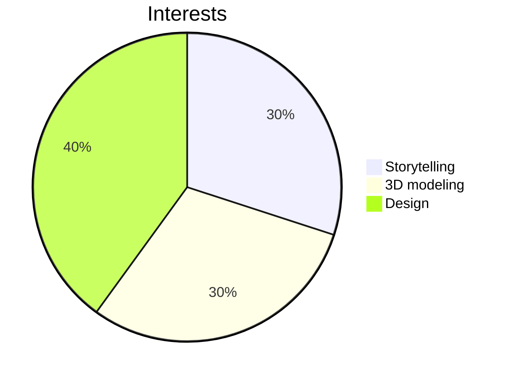

 

# Welcome to my GitHub! I’m a budding creative engineer and artist. 
Passionate about sustainability, community-driven projects, interactive coding, and a dose of random (think movie reviews, solo travel, art installations, and good food). Currently exploring ways to use technology for **positive change** and **empowerment**.

---

## Resources to enjoy
- [JLCPCB Printed Circut Board ordering guide](https://github.com/melanielaporte/JLCPCB-Ordering-Guide). This process is wooly! Reach out with any questions 
- [HTML, CSS, JavaScript Project Template](https://github.com/melanielaporte/project-template-novices) to help start a project quickly
- [Git command line cheatsheet](https://github.com/melanielaporte/gitCheatsheet)
- [Major engineering Project Template.](https://github.com/melanielaporte/Engineering-Project-Template) Includes marketing, hardware, firmware, etc. folders. Created with Forrest "Lee" Erickson

---
## Current  
- Actively contribute to [Public Invention](https://publicinvention.github.io/) global-impact projects
  -- [MoonRatII](https://github.com/melanielaporte/moonrat) portable incubator
  -- [GDT](https://github.com/gosqasorg/asset-provenance-tracking), an humantarian asset provenence tracker
- **Work in:** Python, HTML, CSS, JavaScript, TypeScript, Blender, Kicad PCB design, Freecad
- **Learning:** React, MERN stack, Swift, C++
- **Next up:** Maya, Unity
---
## Work
- **[Memory Card Game](https://github.com/melanielaporte/Pirates-Booty)** - Software used: Figma, HTML, CSS, JS
 --> [Play here!](https://editting-lively-shell-121.vscodeedu.app/)
- **[Minimalistic Website](https://github.com/melanielaporte/sparse_Website)** - Software used: Figma, HTML, CSS, JS
- **[MoonRatII Printed Circuit Board]()** - Software used: C++, Kicad schematic design, Freecad 3d modeling, Ngspice simulation. Hardware used: Soldering Station, Multimeter, Arduino, 3D Printer 
- **[Nonprofit Website Design-Farm To Family](https://github.com/melanielaporte/farmtofamilySite)** - Software used: Figma
- **3D Printing** - Coming Soon
- **3D Solid Modeling/Animation** - Coming Soon
- **Nonprofit Website Coded-SustainTulsa** - Coming Soon

---

### Fun Facts  
- Love storytelling — whether it's crafting narratives in code or writing fiction  
- Fascinated by concepts of "choose your own adventure" and gamefying life functions 
- Enjoy all things DIY

