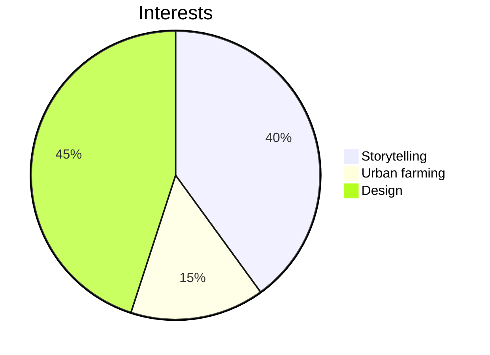

## Welcome to my GitHub! I’m a self-taught programmer, artist, and inventor. 
Passionate about sustainability, community-driven projects, interactive coding, and a dose of random (think “choose your own adventure”, solo travel, art installations, and good food). Currently exploring ways to use technology for **positive change** and **empowerment**.

---

### Technologies & Skills  
- **Languages/Tools:** Git/GitHub, Agile Methodologies, Python, JavaScript, HTML, CSS, TK -> React, Vue.js, Node.js, Swift, MongoDB
- **Design & Engineering:** PCB Design, Figma, SolidWorks, Kicad
  
---

### What I'm Working On  
- **Gamified Schedules:** Currently building `Goal Vault`—a gamified platform to reward users daily achievements.
- **Open Source**: Actively contributing to [Public Invention](https://publicinvention.github.io/), working on global-impact projects like the [MoonRatII](https://github.com/melanielaporte/moonrat) portable incubator and [GDT](https://github.com/gosqasorg/asset-provenance-tracking), an humantarian asset provenence tracker.
- **Gamified Engagement:** Building `BadgeQuest`—a redesign of Reddit’s karma points system.  
- **AR Development:** Exploring immersive experiences with Snap Inc.’s Lens Studio and AR prototyping.

---

### Fun with Code
- **Tiny game - Snack Size Sims [(Github repo)](https://github.com/melanielaporte/snackSizeSims):** [Play here!](https://codepen.io/melanielaporte/pen/KwPpyey)
- **Tiny game - A Forest [(Github repo)](https://github.com/melanielaporte/aForest):** [Play here!](https://codepen.io/melanielaporte/pen/OPLVOON)

---

### Recent Achievements  
- **NASA NPWEE Academy**: Led a team to secure a $10K grant for the NASA International Space Station (ISS) innovation prototype.  
- **Public Invention**: Designed and developed PCB systems for a portable incubator for social good, co-authoring a scientific paper slated for 2025 publication.  
- **Girls Who Code/RTX/Raytheon Leadership Fellow**: Created Code Wayfinder, an education app to assist users interested in coding careers. 

---

### Fun Facts About Me  
- Love storytelling — whether it's crafting narratives in code or writing fiction.  
- Fascinated by ideas of "choose your own adventure" and gamefying life functions. 
- Enjoy all things urban farming.

---

### Let’s Connect  
- **LinkedIn**: https://www.linkedin.com/in/melanielaporte
- **Portfolio**: Coming Soon! 
