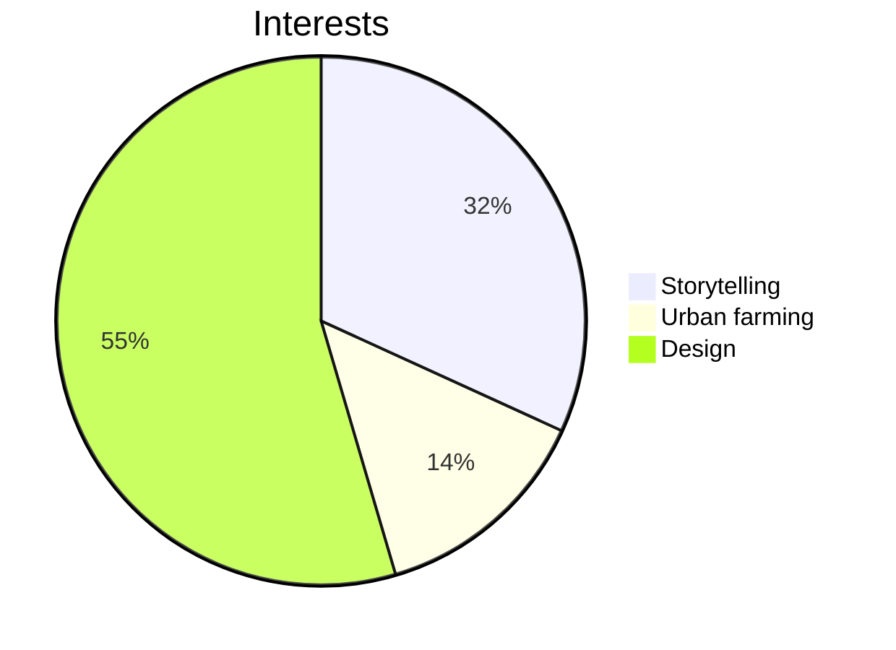

 

## Welcome to my GitHub! I’m a programmer, artist, and inventor. 
Passionate about sustainability, community-driven projects, interactive coding, and a dose of random (think “choose your own adventure”, solo travel, art installations, and good food). Currently exploring ways to use technology for **positive change** and **empowerment**.

---

### Resources to enjoy
- [JLCPCB Printed Circut Board ordering guide](https://github.com/melanielaporte/JLCPCB-Ordering-Guide). This process is wooly! Reach out with any questions 
- [HTML, CSS, JavaScript Project Template](https://github.com/melanielaporte/project-template-novices) to help start a project quickly
- [Git command line cheatsheet](https://github.com/melanielaporte/gitCheatsheet)
- [Major engineering Project Template.](https://github.com/melanielaporte/Engineering-Project-Template) Includes marketing, hardware, firmware, etc. folders. Created with Forrest "Lee" Erickson

---

### Current Work  
- Actively contribute to [Public Invention](https://publicinvention.github.io/) global-impact projects
  -- [MoonRatII](https://github.com/melanielaporte/moonrat) portable incubator
  -- [GDT](https://github.com/gosqasorg/asset-provenance-tracking), an humantarian asset provenence tracke
- Learning React and the MERN stack
  
---

### Tiny Games
- **Snack Size Sims [(Github repo)](https://github.com/melanielaporte/snackSizeSims):** [Play here!](https://codepen.io/melanielaporte/pen/KwPpyey)
- **A Forest [(Github repo)](https://github.com/melanielaporte/aForest):** [Play here!](https://codepen.io/melanielaporte/pen/OPLVOON)
- **Pirate's Booty [(Github repo)](https://github.com/melanielaporte/Pirates-Booty)**
  
---

### Fun Facts About Me  
- Love storytelling — whether it's crafting narratives in code or writing fiction  
- Fascinated by ideas of "choose your own adventure" and gamefying life functions 
- Enjoy all things DIY.

